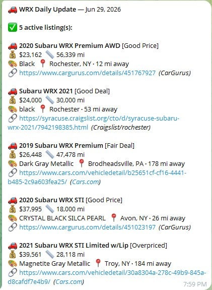

# USA Car Search

[](https://github.com/Frojoe6969/usa-car-search/actions/workflows/ci.yml)
[](https://github.com/Frojoe6969/usa-car-search/pkgs/container/usa-car-search)
[](https://github.com/Frojoe6969/usa-car-search/releases/latest)
[](https://www.python.org/)
[](LICENSE)

A Python scraper that searches multiple US car listing sites for used vehicles matching your criteria and sends Telegram alerts for new listings. Built for reliability: it handles bot detection, session management, cross-source deduplication, and automatic token refresh with minimal manual intervention.

Works for any make and model. Set your filters once, run it on a schedule, and get notified when something new hits the market.



> **US only.** Distance filtering uses US ZIP codes via the `pgeocode` library, and all supported listing sites are US-based.

---

## Who This Is For

USA Car Search is for people who want to monitor used-car listings across several US marketplaces without manually checking each site every day. It is especially useful when you are waiting for a specific make, model, trim, year range, mileage range, color, or price range and want Telegram alerts when new matches appear.

---

## Features

- **7 sources**: CarGurus, Cars.com, Craigslist, AutoTrader, Facebook Marketplace, eBay Motors, auto.dev
- **Telegram alerts**: sends a formatted summary of new listings with price, mileage, color, location, distance, and deal rating
- **Cross-source deduplication**: same car listed on multiple sites appears only once, matched by VIN or a year/mileage/price fingerprint
- **Deal ratings**: Great Deal / Good Deal / Fair Deal / High Priced / Overpriced shown for every listing; computed from median price when the source doesn't provide its own rating
- **Persistent seen list**: tracks listings between runs; only new ones trigger alerts; sold/removed listings are counted and reported
- **Distance filtering**: haversine distance from your ZIP, computed via `pgeocode`; listings outside radius are skipped
- **Color and trim filtering**: configurable; default targets black/grey/charcoal
- **Year and mileage filtering**: applied at scrape time for all sources
- **eBay OAuth with auto-refresh**: access token auto-refreshed on every run; stays valid for about 18 months without manual intervention
- **AutoTrader Chrome CDP**: connects to a real Chrome instance to bypass bot detection; auto-relaunches Chrome if connection drops; falls back to headless Playwright if CDP unavailable
- **Craigslist multi-region**: searches multiple metro areas in parallel, each with its own browser context to avoid threading errors
- **CarGurus city/state/distance resolution**: when the API doesn't return a state or distance, falls back to ZIP lookup then city-name search across all US ZIP codes within radius
- **Cars.com ZIP resolution**: resolves raw ZIP codes to City, ST format for cleaner output
- **Facebook session persistence**: saves and reuses a logged-in session; prompts to re-auth when expired
- **Enable/disable per source**: any source can be toggled off via env var without touching code

---

## Quick Start With Docker

Docker is the fastest way to try the project without managing Python browser dependencies manually.

```bash
cp .env.example .env
# Edit .env with your vehicle, ZIP, Telegram bot, source URLs, and API keys.

docker compose run --rm car-search --notify
```

Use `--all` on the first run if you want every current listing treated as new:

```bash
docker compose run --rm car-search --all --notify
```

You can also build and run the image directly:

```bash
docker build -t usa-car-search .
docker run --rm --env-file .env -v "$PWD/data:/data" usa-car-search --notify
```

---

## Local Installation

Prerequisites:

- Python 3.9+
- WSL2, Linux, or Docker
- Chromium installed by Playwright

Install dependencies from the project metadata:

```bash
python3 -m pip install --upgrade pip
python3 -m pip install -e .
playwright install chromium
usa-car-search --notify
```

Or install directly from `requirements.txt`:

```bash
python3 -m pip install -r requirements.txt
playwright install chromium
```

Optional: load config from a `.env` file with `python-dotenv`, which is included in the default dependencies.

---

## Quick Start Locally

**1. Copy and fill in your config:**

```bash
cp .env.example .env
# Edit .env with your vehicle, ZIP, Telegram bot, source URLs, etc.
```

**2. Uncomment the dotenv loader** at the top of `usa-car-search.py`:

```python
from dotenv import load_dotenv
load_dotenv()
```

**3. Run it:**

```bash
usa-car-search           # print results to stdout
usa-car-search --notify  # also send Telegram alert
usa-car-search --all     # treat all listings as new (good for first run)
```

The legacy script path still works:

```bash
python3 usa-car-search.py --notify
```

---

## Current Limitations

- **US only**: ZIP-code distance calculations and supported sources are US-focused.
- **Scraping can break**: listing sites change markup, APIs, bot checks, and login flows without notice.
- **AutoTrader works best with Chrome CDP**: headless fallback exists, but CDP produces better results.
- **Facebook requires a saved login session**: run `fb-auth-setup.py` and keep session files private.
- **Credentials stay local**: do not commit `.env`, token files, cookies, `fb-session.json`, or logs containing private data.

---

## How It Works

```text
Listing sources
  -> source-specific scraping/API adapters
  -> year, mileage, price, color, trim, and distance filters
  -> VIN and fingerprint deduplication
  -> seen-list diff
  -> deal rating
  -> stdout and optional Telegram alerts
```

1. **Scrape**: all enabled sources run in sequence, each applying year/mileage/color/distance filters before returning results
2. **Deduplicate**: results are merged across sources; same car matched by VIN first, then by (year, mileage, price) fingerprint with price bucketed to the nearest $500 to account for dealer fee differences
3. **Diff against seen list**: `seen.json` stores listing IDs from prior runs; anything not in the file is flagged as new
4. **Rate deals**: each listing gets a deal rating based on price vs. median across all results; sources like CarGurus and Cars.com provide their own ratings which are used directly
5. **Output**: results printed to stdout in a readable format; if `--notify` is passed, new listings are also sent to Telegram
6. **Update seen list**: `seen.json` is updated with the current run's listings; disappeared listings are noted

---

## Sources

| Source | Method | Bot Resistance | Notes |
|---|---|---|---|
| CarGurus | Browser scrape | Medium | Paste your search URL; supports 2 URLs, for example two trims |
| Cars.com | Browser scrape | Medium | Paste your search URL |
| Craigslist | Browser scrape | Low | Multi-region, keyword search, parallel |
| AutoTrader | Browser scrape | High | Chrome CDP recommended; auto-relaunches on disconnect |
| Facebook Marketplace | Browser scrape | High | Requires saved login session |
| eBay Motors | REST API + scrape | Low | OAuth recommended; auto-refreshes token |
| auto.dev | REST API | Low | Free API key required |

---

## Configuration

All settings are environment variables. Set them in `.env` or export them in your shell. See `.env.example` for a full template.

### Vehicle

```env
SEARCH_MAKE=Honda
SEARCH_MODEL=Civic
SEARCH_KEYWORDS=honda civic    # used for free-text search (Craigslist, Facebook, eBay)
```

### Location & Filters

```env
SEARCH_ZIP=90210
SEARCH_RADIUS=150      # miles from ZIP
MIN_YEAR=2020
MAX_YEAR=2023
MAX_MILES=50000
MIN_PRICE=15000
MAX_PRICE=35000
```

### Color Filtering

Set `ALLOWED_COLORS` to a comma-separated list. Matching is case-insensitive and substring-based. Leave it blank to accept every color.

```env
ALLOWED_COLORS=black,gray,grey,charcoal,dark,obsidian,magnetic,graphite

# Accept any color:
ALLOWED_COLORS=
```

### Trim Filtering

Set `ALLOWED_TRIMS` to a comma-separated list. Leave it blank to accept every trim.

```env
ALLOWED_TRIMS=limited,sti

# Accept every trim:
ALLOWED_TRIMS=
```

### Enable/Disable Sources

```env
ENABLE_CARGURUS=true
ENABLE_CRAIGSLIST=true
ENABLE_CARSDOTCOM=true
ENABLE_AUTOTRADER=true
ENABLE_FACEBOOK=true
ENABLE_EBAY=true
ENABLE_AUTODEV=true
```

---

## Source Setup

### Craigslist

Set `CL_REGIONS` to a comma-separated list of subdomain slugs. Find them at [craigslist.org/about/sites](https://www.craigslist.org/about/sites).

```env
CL_REGIONS=newyork,boston,philadelphia
```

### CarGurus, AutoTrader, Cars.com

These sites use internal make/model codes that vary by vehicle. The easiest approach:

1. Go to the site
2. Set all your filters: make, model, year range, mileage, color, ZIP, radius
3. Copy the URL from your browser address bar
4. Paste it into `.env`

```env
CARGURUS_URL=https://www.cargurus.com/Cars/l-Used-Honda-Civic-d2188?zip=90210&distance=100&...
AUTOTRADER_URL=https://www.autotrader.com/cars-for-sale/used-cars/honda/civic/?zip=90210&...
CARSDOTCOM_URL=https://www.cars.com/shopping/results/?makes[]=honda&models[]=honda-civic&...
```

You can set `CARGURUS_URL_2` for a second CarGurus search, for example a different trim or body style.

### Facebook Marketplace

Facebook requires a real logged-in session. Run the auth setup script once:

```bash
python3 fb-auth-setup.py
```

A browser window opens. Log into Facebook, then press Enter. Your session is saved to `fb-session.json`. Re-run when it expires, typically every few weeks.

```env
FB_CITY=newyork       # city slug from facebook.com/marketplace/<city>/search
FB_SESSION_FILE=./fb-session.json
```

### eBay Motors

The scraper uses eBay's OAuth 2.0 API and automatically refreshes the access token before each run. Initial setup takes about 5 minutes.

**One-time setup:**

1. Sign up at [developer.ebay.com](https://developer.ebay.com) and create a **Production** app
2. Under your app -> **User Tokens**, note your **RuName** (Redirect URL name)
3. Set your credentials in `.env`:
   ```env
   EBAY_CLIENT_ID=YourApp-PRD-xxxxxxxxxxxx
   EBAY_CLIENT_SECRET=PRD-xxxxxxxxxxxx
   EBAY_RUNAME=YourRuName-here
   ```
4. Run the setup script:
   ```bash
   python3 ebay-oauth-setup.py
   ```
   It will print an authorization URL. Open it in your browser, sign in with your eBay account, then paste the redirect URL back when prompted.
5. Tokens are saved to `ebay-token.txt` and `ebay-refresh-token.txt` and auto-refreshed from then on.

The refresh token lasts about 18 months. Re-run `ebay-oauth-setup.py` once it expires.

> If no token is configured, the scraper falls back to page scraping eBay, which is less reliable.

### auto.dev

Get a free API key at [auto.dev](https://auto.dev). Set `AUTODEV_API_KEY`.

---

## AutoTrader: Chrome CDP Setup (Recommended)

AutoTrader aggressively blocks headless browsers. Connecting to a real Chrome instance via Chrome DevTools Protocol (CDP) bypasses detection and produces much better results.

**Windows/WSL2 setup:**

1. Create `launch-chrome-debug.bat`:

```batch
"C:\Program Files\Google\Chrome\Application\chrome.exe" ^
  --remote-debugging-port=9222 ^
  --remote-debugging-address=0.0.0.0 ^
  --remote-allow-origins=* ^
  --user-data-dir="C:\Temp\chrome-debug" ^
  --no-first-run ^
  about:blank
```

2. Run this bat file before running the scraper. You can add it to Windows Task Scheduler to launch at login automatically.

3. Find your Windows host IP from WSL2:

```bash
ip route show default | awk '{print $3}'
```

4. Set it in `.env`:

```env
CHROME_CDP_HOST=172.x.x.x
CHROME_CDP_PORT=9222
```

5. If Chrome is unreachable from WSL2, add a Windows port forwarding rule. Run as admin in PowerShell:

```powershell
$wsl = (wsl hostname -I).Trim()
netsh interface portproxy add v4tov4 listenport=9222 listenaddress=0.0.0.0 connectport=9222 connectaddress=$wsl
```

**Auto-relaunch:** If the CDP connection drops mid-run (ECONNRESET), the scraper will automatically kill and relaunch Chrome, then retry once before giving up.

**Fallback:** If CDP is not configured or Chrome is unreachable, AutoTrader falls back to headless Playwright automatically. Results may be limited due to bot detection.

---

## Telegram Notifications

1. Create a bot with [@BotFather](https://t.me/BotFather), copy the token
2. Add the bot to your chat or channel
3. Get your chat ID. For groups/channels, use [@userinfobot](https://t.me/userinfobot) or the Telegram API
4. Set in `.env`:

```env
TG_BOT_TOKEN=123456:ABC-...
TG_CHAT_ID=-1001234567890
TG_TOPIC_ID=42   # optional: for Telegram forum/topic threads
```

Run with `--notify` to send alerts:

```bash
usa-car-search --notify
```

Each new listing is sent as a separate message with price, mileage, color, location, distance away, deal rating, and a direct link.

---

## Automated Daily Runs

Add to crontab on Linux/WSL2:

```bash
crontab -e
```

```cron
0 17 * * * cd /path/to/usa-car-search && usa-car-search --notify >> search.log 2>&1
```

This runs at 5 PM every day and sends Telegram alerts for any new listings found since the last run.

---

## Location Resolution

Distance is computed as haversine miles from `SEARCH_ZIP`. For sources that return a ZIP code, distance is derived directly. For CarGurus listings that only return a city name, the scraper:

1. Looks up the city across all US ZIP codes in the `pgeocode` database
2. Finds the closest match within `SEARCH_RADIUS`
3. Uses that match's state abbreviation and distance

This means "Avon" correctly resolves to "Avon, NY - 27 mi away" rather than just "Avon".

---

## Adapt for Any Vehicle

1. Set `SEARCH_MAKE`, `SEARCH_MODEL`, and `SEARCH_KEYWORDS`
2. Go to CarGurus, AutoTrader, and Cars.com, search with your filters, then copy and paste the URLs into `.env`
3. Set Craigslist regions near you (`CL_REGIONS`)
4. Set `ALLOWED_COLORS` and `ALLOWED_TRIMS` in `.env` if you want those filters
5. Run with `--all` on first run to see all current listings, then switch to normal runs

---

## Tests

Run the lightweight core tests locally:

```bash
python3 -m unittest discover -s tests
```

The CI workflow runs these tests across Python 3.9, 3.10, 3.11, and 3.12, then verifies the Docker image builds.

---

## Releases

Pushing a tag such as `v1.3.1` runs the release workflow and publishes a Docker image to GitHub Container Registry:

```bash
git tag v1.3.1
git push origin v1.3.1
```

---

## Contributing

Bug reports, source requests, and pull requests are welcome. See [CONTRIBUTING.md](CONTRIBUTING.md) for reporting guidelines, local checks, and source-integration expectations.

For GitHub-side polish such as topics and social preview artwork, see [docs/repo-discoverability.md](docs/repo-discoverability.md).

---

## Changelog

### 2026-06-29
- **Fix:** AutoTrader crash after run: `headless=False` was crashing the Playwright browser in headless environments (WSL2 without a display), killing the entire script after AutoTrader completed. Scraper now auto-detects display availability and falls back to `headless=True` when no display is present
- **Fix:** AutoTrader "Cannot switch to a different thread": Playwright sync API is thread-locked; the daemon thread approach was fundamentally broken. AutoTrader now runs in a dedicated subprocess (`_at_worker.py`) so Playwright runs on a proper main thread with full CDP support
- **Fix:** AutoTrader CDP host: worker subprocess now correctly reads `CHROME_CDP_HOST` from env (previously hardcoded to wrong IP)
- **New:** `_at_worker.py`: standalone AutoTrader worker script; spawned as a subprocess by the main scraper; outputs raw listings JSON to stdout for the parent to filter

### 2026-06-25
- **Fix:** eBay OAuth: removed `buy.item.summary` scope that was causing HTTP 400 errors during token refresh; only `api_scope` is required and granted by default
- **Fix:** eBay OAuth setup script (`ebay-oauth-setup.py`) updated to match; bad scope removed there too
- **Fix:** CarGurus city/state/distance: when API returns only a city name with no state or distance, scraper now searches all US ZIP codes for that city name and resolves to the closest match within radius, for example "Avon" -> "Avon, NY - 27 mi away"
- **Fix:** Cross-source deduplication: VIN-matched listings now also add their fingerprint to the seen set, preventing the same car from appearing twice when one source has a VIN and another doesn't
- **Fix:** Cross-source price deduplication: price bucketed to nearest $500 before fingerprinting to handle dealer fee differences between sources, for example auto.dev adds about $200 in fees
- **Fix:** Cars.com location: raw ZIP codes now resolved to "City, ST" format via pgeocode lookup
- **Fix:** AutoTrader Chrome CDP: scraper now auto-kills and relaunches Chrome when a stale CDP session is detected (ECONNRESET), then retries once before falling back
- **Fix:** Craigslist threading: each parallel worker now spawns its own Playwright browser/context instead of sharing the parent context across threads, eliminating greenlet/threading errors

### 2026-06-24
- Initial public release
- CarGurus, Cars.com, Craigslist, AutoTrader, Facebook Marketplace, eBay Motors, auto.dev sources
- eBay OAuth 2.0 with auto-refresh
- Telegram notifications with deal ratings
- Cross-source deduplication by VIN and fingerprint
- pgeocode distance filtering
- `seen.json` persistence between runs
- `--notify`, `--all` flags
- `.env`-based configuration
- `ebay-oauth-setup.py` helper script